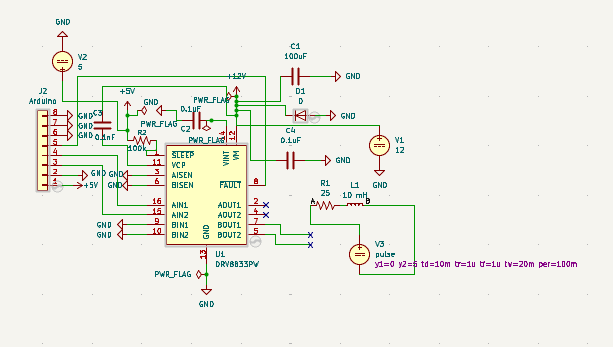
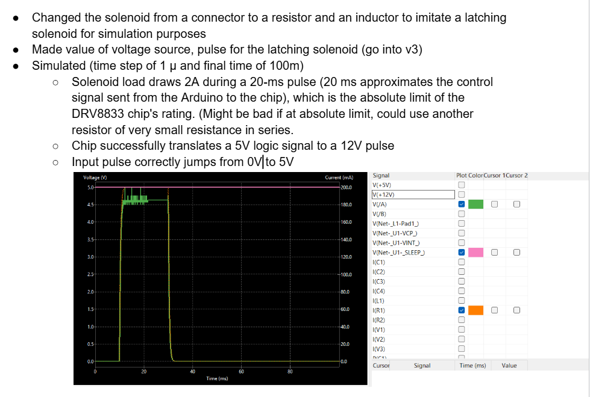

Developing code for Robotic Cello Left Hand AIM Project. The robot cello's left hand will consist of latching solenoids to imitate the feel of a finger pressing down on cello strings. An Arduino Mega and a DRV8833 Dual H-Bridge Motor Driver, along with the latching solenoids, will be used for this project. Some code will be reused from the Robotic Glockenspiel Project.

